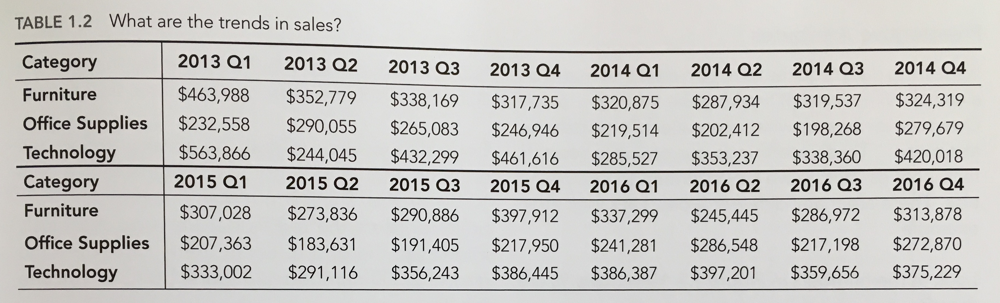
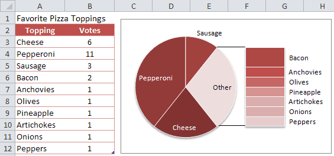
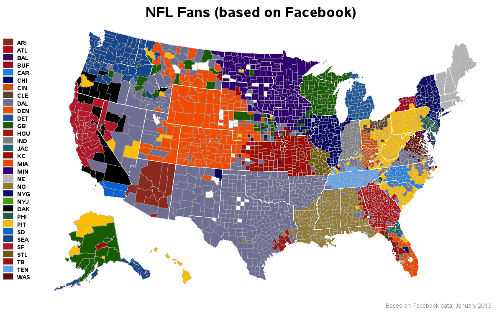
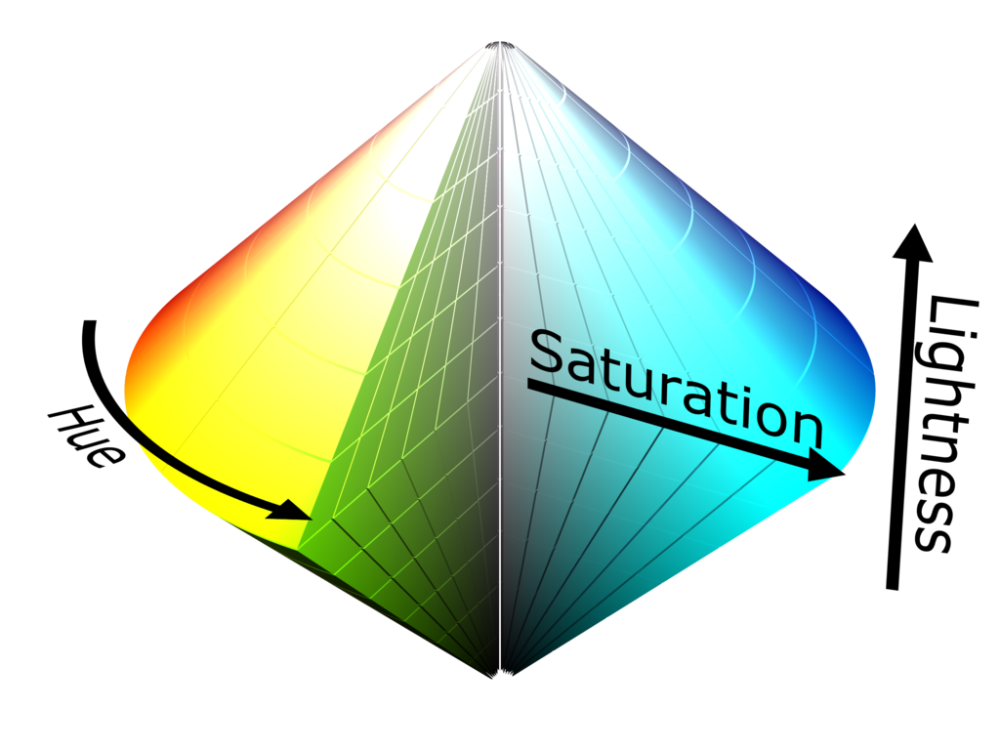
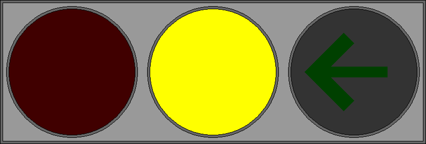
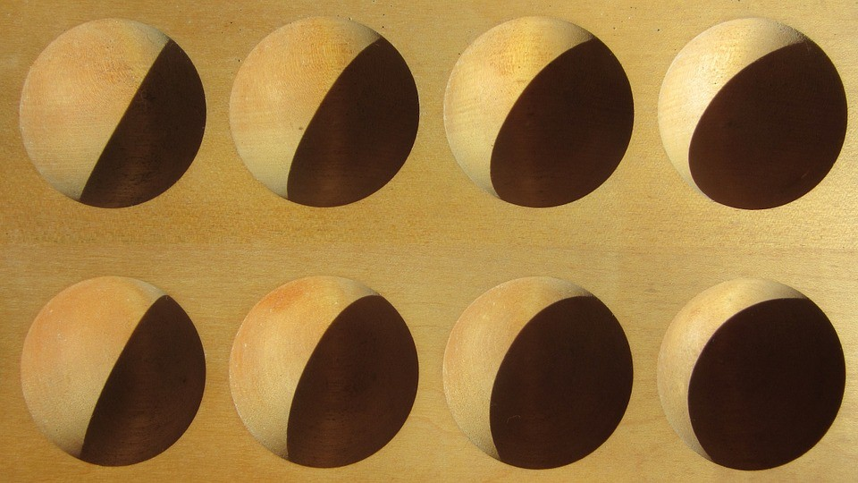
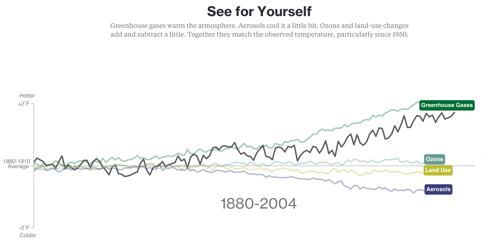
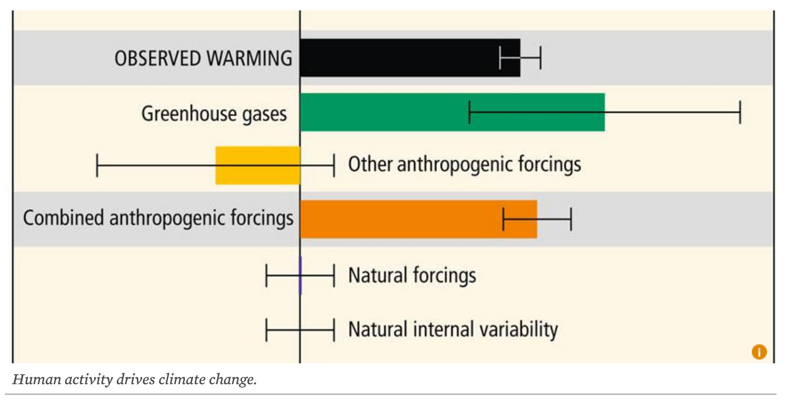
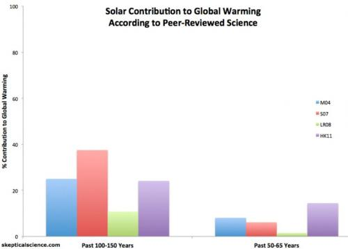

# (PART\*) Part I Data Visualization {-} 

# What is Visualization and Why Do We Visualize Data?
Visualization is the graphical representation of information and data. By using visual elements like charts, graphs, and maps, data visualization tools provide an accessible way to see and understand trends, outliers, and patterns in data [@Tableau].

We visualize data to harness the incredible power of our visual system, to <strong>spot relantionships and trends</strong>.
Imagine if you were given a table of sales data as below: 
<center>
{width=500px}  
[@Wexler]
</center>
Would you be able to tell which quarters and category performed best?  
  
Alternatively if we plot the same data into a line chart,  

<center>
{width=500px}  
[@Wexler]
</center>
  
We can now see the sales trend by category for each quarter.  

Here's another example with a pie chart:  
<center>{width=400px}</center>
  
Another purpose of visualizing data is to <strong>help our memory</strong>. Human brains tend to remember images easier and longer than numbers in a table. 

# Types of visualization
There are many types of visualization, some popular ones being:

## Charts
<center>
```{r, out.width = "50%",fig.cap='Source: https://www.vertex42.com/edu/charts-and-graphs-in-excel.html', echo=FALSE}
knitr::include_graphics('images/bar_chart.png') 
```
</center>
  
## Tables
<center>
```{r, out.width = "50%",fig.cap='Source: https://docs.microsoft.com/en-us/power-bi/visuals/power-bi-visualization-tables', echo=FALSE}
knitr::include_graphics('images/table.png') 
```
  
  
```{r out.width="50%", fig.cap='Source: https://www.dundas.com/dundas-bi/features', echo=FALSE}
knitr::include_graphics('images/table2.png')
```
</center>

## Graphs
<center>
```{r out.width="50%", fig.cap='Source: https://www.livestories.com/blog/five-ways-to-fail-data-visualization', echo=FALSE}
knitr::include_graphics('images/3dbar.png')
```
</center>  

## Maps
<center>  
```{r out.width="50%", fig.cap='Source: https://blogs.sas.com/content/sastraining/2013/05/16/visualizing-nfl-fans-on-a-map-based-on-facebook-like-data/', echo=FALSE}

```
</center>  
  
## Infographics
<center>
```{r out.width="50%", fig.cap='Source: https://blog.prototypr.io/getting-it-right-why-infographics-are-not-the-same-as-data-visualizations-a23da7de745e?gi=7f75b89fc41e ', echo=FALSE}

```
</center>  
  
## Dashboards
<center>
```{r out.width="50%", fig.cap='Source: https://www.dundas.com/dundas-bi/features', echo=FALSE}
knitr::include_graphics('images/dashboard.png')
```
</center>  

<p style="page-break-before: always">
# Criterias of a Good Visualization
## The Human Brain and Sight
Did you know that the human brain can process entire images that the eye sees for as little as 13 milliseconds? Vision begins with light passing through the cornea and the lens, which combine to produce a clear image of the visual world on our retina. Information from the retina is then sent via the optic nerve to the brain, which process the image and allow us to see.

With our brains processing the things we see at such great speed, how then do we capture the viewer's attention to focus, understand and remember the data?

## Preattentive Attributes
Preattentive attributes or properties are visual properties that are processed in spatial memory without our conscious action. These properties can be harnessed to make it easier for a user to understand what is presented through the design and save them from consciously processing all the data presented in short-term memory which requires more effort [@IDF].

There are 4 preattentive attributes:  

1. Color
2. Form
3. Movement
4. Spatial Positioning

### Color
Hues and intensities are preattentively processed and can be used to separate visual elements from their surroundings. This helps the user to identify key points in the data at first glance, saving them from having to perform a visual search through data. 

<center>
```{r, out.width = "50%",fig.cap='(Author/Copyright holder: SharkD. Copyright terms and licence: CC BY-SA 3.0)', echo=FALSE}

```
</center>
### Form
Form applies to a set of attributes (listed below) and form can be manipulated to either call attention to a member of the data set or to reduce our attention on it. For example, if you were to manipulate the size of an object you could use that size to indicate its importance in a data set by making it larger. Conversely you could make it smaller and reduce its importance.

Form attributes include:

- Collinearity
- Curvature
- Length, breadth and width
- Marks added to objects
- Numerosity
- Shape
- Size
- Spatial grouping
- Spatial orientation

<center>
```{r, out.width = "50%",fig.cap='Source: https://www.interaction-design.org/literature/article/preattentive-visual-properties-and-how-to-use-them-in-information-visualization', echo=FALSE}
knitr::include_graphics('images/form.jpg')
```
</center>

In the image above you can see how each form property can be used to call attention to a part of a visualization; you might not realize it but you didn’t even have to think to see these differences – it was all done in your sensory memory without conscious effort. 

### Movement
Movement has two sub-attributes flicker and motion. They can be used very effectively to call someone’s attention. However, care should always be taken when employing motion in information visualizations and other designs. This is because the motion can rapidly become annoying or distracting from the rest of the information that is being presented. It’s also a technique which has been over-employed in banner adverts and other forms of web advertising over the years and may be a primary reason for the rise of ad-blocking software. 

<center>
```{r, out.width = "50%",fig.cap='Source: https://www.interaction-design.org/literature/article/preattentive-visual-properties-and-how-to-use-them-in-information-visualization (Author/Copyright holder: P.Ctnt. Copyright terms and licence: Public Domain.)', echo=FALSE}

```
</center>

The central traffic light in this GIF flickers to call the user’s attention to the yellow light rather than the red light or green arrow.

### Spatial Positioning
There are several considerations for spatial positioning including:

- 2D positioning – this is often the best way to deliver data that can be easily recognized and processed visually. It is particularly effective for quantitative data representations.
- Stereoscopic depth - we perceive depth by combining the images generated by the left and right eyes in the brain. This depth is preattentively processed. It is possible to recreate stereoscopic depth using two separate cameras set at different angles to a subject and imposing the images over each other.
- Concave and convex positioning – this can be created through the use of shading.

<center>
{width=400px}
</center>
In this image we can see the use of shading to suggest convex/concave properties. These are then preattentively processed in the brain.  
Now that we know what makes a good visualization, let's have a look at some data visualization on climate change causes and evaluate their effectiveness of using preattentive attributes.

<p style="page-break-before: always">
# Evaluation
Aside from the 4 attributes, we also evaluate visualization based on relevancy, interpretablity, simplicity.

Often a visualization is a summary of a story, put into an image that best present the idea behind the story. It may show the causes of an event, the changes over time or the effects of an event. In some instances, we use it to highlight a specific point that prompts the reader to take action.

## Relevancy
Visualization complements or emphasizes a point in its accompanying story. It should include the right information that relates to the story. Data integrity and accuracy is also important. To have accuracy, data used for visualization should be comprehensive, without omission. For example, if the story is to describe change over time, then the duration of time used in the visualization should be suffifient to show the full picture of the change being highlighted in the story.

## Interpretability
A roomful of conflicting interpretations is usually a sign that something is missing. To ensure interpretability, we need select the right type of visualization to convey the information. In some situations, a pie chart may present the results in a more clear and consise manner as to a bar chart. Hence, it is important to understand the purpose of the dataset so that we are able to choose the right visualization medium to present it. While there can be many different interpretation of a visualization by different individuals, ultimately they should all convey the same underlying idea or support the same overarching concept. 

## Simplicity
Visualization should be clear and easily understood. Complex visualization can be confusing to the reader and may mislead them to a different conclusion from intended. 

Clarity on visualization can be achieved by including legends so that readers have a guide to what the parts of the visualization mean. Legends can be used to define all the symbols, figures, axes, colors, data ranges and other graphical components in a visualization.

# Evaluation Framework
Using the above discussed attributes, we come up with a simple framework to evaluate visualizations. The criterias covered are as follows:

1. Suitable type of visualization used for the topic
2. Use of colors to draw attention
3. Use of colors/shapes/patterns to differentiate between elements
4. Labeled axis, with clear units
5. Title to indicate the topic 
6. Proper use of white space between elements
7. Contains dataset covers duration sufficient to justify change in pattern
8. Movement/Animation to draw attention
9. Describes the topic discussed
10. Integrity of data
11. Presents insights/prediction on data
12. Clearness (quality) of visualization

<p style="page-break-before: always">
# (PART\*) Part II Climate Change Caused by Human Activity {-}
# Use Case
To test the evaluation framework, we use 5 visualization relating to climate change causes.

Before we begin looking at the data visualization. Let's learn on what is climate and how is it changing? What are the effects of it and what causes these changes.

## What is Climate?
Climate describes conditions over the long term and over an entire region. [@ClimateKidsNasa]

## Climate Change
Global climate is changing rapidly compared to the pace of natural variations in climate that have occurred throughout Earth’s history. Global average temperature has increased by about 1.8°F from 1901 to 2016, and observational evidence does not support any credible natural explanations for this amount of warming; instead, the evidence consistently points to human activities, especially emissions of greenhouse or heat-trapping gases, as the dominant cause.[@NCA]

## Causes of Climate Change
Climate change can be caused by human activities and nature.  

Here we take a look at 5 visualization that shows the causes of climate change.

<center>
<strong>Visualization 1</strong>
```{r, out.width = "80%",fig.cap='Source: https://www.bloomberg.com/graphics/2015-whats-warming-the-world/', echo=FALSE}

```
  
<strong>Visualization 2</strong>  
```{r, out.width = "60%",fig.cap='Source: https://www.ucsusa.org/global-warming/science-and-impacts/science/human-contribution-to-gw-faq.html', echo=FALSE}
knitr::include_graphics('images/human_contribution_to_atmospheric_co2.png')
```
  
<strong>Visualization 3</strong>  
```{r, out.width = "60%",fig.cap='Source: https://www.ucsusa.org/global-warming/science-and-impacts/science/human-contribution-to-gw-faq.html', echo=FALSE}

```
  
<strong>Visualization 4</strong>  
```{r, out.width = "60%",fig.cap='Source: http://www.bom.gov.au/state-of-the-climate/2016/', echo=FALSE}
knitr::include_graphics('images/WMO-temperature_changes.png')
```
  
<strong>Visualization 5</strong>  
```{r, out.width = "60%",fig.cap='Source: https://www.skepticalscience.com/graphics.php?g=58', echo=FALSE}

```
</center>

<p style="page-break-before: always">
## Evaluation Metrics
Using the evaluation framework described, we evaluate each of the visualization.
  
For each criteria listed, we give a point if the visualization meets the criteria

||**Criteria**| **Visual 1**| **Visual 2** | **Visual 3** | **Visual 4**| **Visual 5**|
|--|--------------------------|-----------|-----------|-----------|-----------|-----------|
|1.|Suitable type of visualization used for the topic|1|1 |1 | 1|1 |
|2. |Use of colors to draw attention| 1|1| 1| 1| 1|
|3. |Use of colors/shapes/patterns to differentiate between elements| 1|1 |1 | 1| 1| 
|4. |Labeled axis, with clear units| 1|1 |0 |1 |1 |
|5. |Title to indicate the topic | 1|1 |1 |1 |1 |
|6. |Proper use of white space between elements|1 | 1| 1| 1| 1 |
|7. |Contains dataset covers duration sufficient to justify change in pattern (> 10 years)|1 |1 |0  | 1| 1|
|8. |Movement/Animation to draw attention| 1| 0| 0| 0| 0|
|9. |Describes the topic discussed| 1|1 | 1|1 |1 |
|10. |Integrity of data (data provided by valid sources)|1 |1 |1 |1 |1 |
|11. |Presents insights/prediction on the future/data| 0| 0|1 |0 |1 |
|12.|Clearness (quality) of visualization|1|1|1|1|0|
||Total Score| 11| 10|9 |10 |10 |

## Assessment
All five visualization agrees that earth's climate is changing and the at the average temperature is increasing each year.  
  
**Visualization 1**: Shows that greenhouses gasses emitted from human activities are the largest contributor to the increasing temperatures. While aerosol and land-use reduces the temperature. The line graph used is clear in presenting the information as it uses different colors and labels to identify each cause. While there are no ticks for years on the x-axis, it shows that the years observed ranges between 1880 - 2004 and a hover over the lines would show its exact year value for the point of hover.  
  
**Visualization 2**: Shows the increase in carbon dioxide concentration in our atmosphere each year, causing the earth's rise in temperature. The different hue of red from light to dark is used to emphasize increasing CO2 levels from fair to worst as each year passes.  
  
**Visualization 3**: Shows the distribution of human activities comparing to natural forcings that contributed to climate change. From the boxplot, we can easily tell the outliers and distribution, however, it does not provide the numbers to show it's impact.  
  
**Visualization 4**: Shows that a change in temperature anomaly happened after 1975, where a La Nina year is now warmer than El Nino years in prior 1960. The bar chart uses different colors to indicate the different natural phenomenons distinctly.  
  
**Visualization 5**: Shows the percentage contribution of solar variability to global warming for 2 time periods, the past 100-150 years (left) and the past 50-65 years (right), from various peer-reviewed studies. From the graph, it is apparent that solar activity percentage contribution has greatly reduced in the past 50-65 years, although the overall global warming is increasing - indicating that human activities contribituon have grown larger in proportionate and will likely to continue so in the next 50 years. Unfortunately, the image quality is poor for the visualization and hence, cannot capture the reader's attention well. Moreover, if we compare the colors palette being used between visualization 4 and 5, we can see that visualization 4 does a better job at contrasting the different elements and increase overall appeal to the reader.

# conclusion
From the above visualizations, we can see that each of them vary with style and type, each to fit the dataset and message to be conveyed. The evaluation metrics shows that Visualization 1 met all the criterias of a good visualization - one able to capture the reader's attention well and conveyed the message with lease effort for the reader. However, is it truly the best visualization of the five? In my opinion, because visualization is a branch of design, there is no one right answer to which is the best. Just as how art is subjective, so is visualization. Different readers will interpret and perceive the same visualization differently because our minds do not process information the same way. Hence, guidelines can only be in place for best practices. If information is always presented to us in the same template/format, it trains our minds to identify things more quickly as our eyes know how to follow the flow of the information being presented. At the same time, it also enables us to spot something that is different from the rest quickly. Inclonclusion, preattentive attributes play a very important role in visualizations, along with its accuracy and relevance.